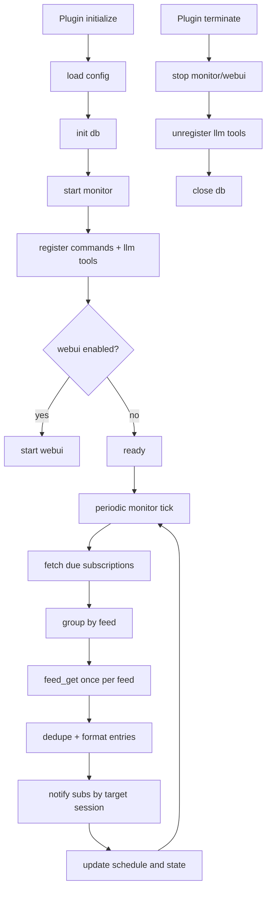
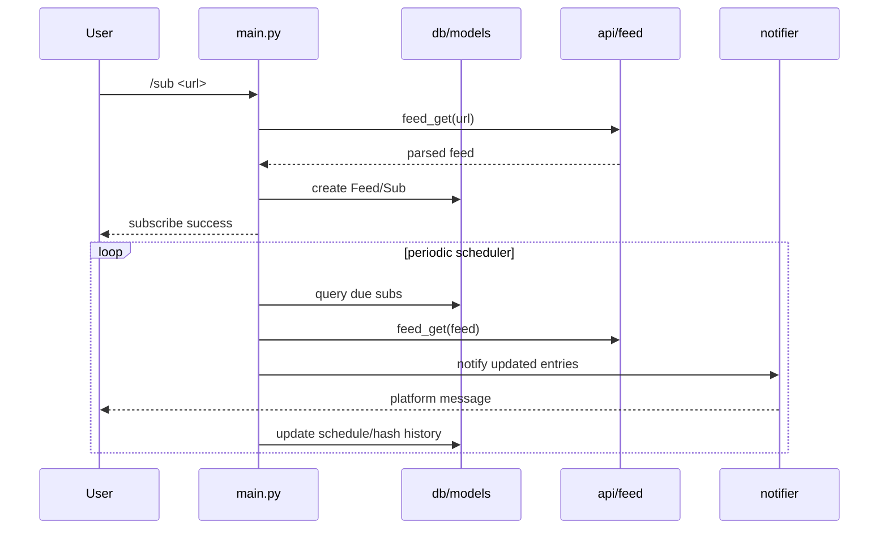

# CONTRIBUTING Guide for `astrbot_plugin_rsshub`

本文面向希望参与 `astrbot_plugin_rsshub` 开发与维护的贡献者，帮助你快速理解项目结构、模块职责、运行流程与开发规范。

## 1. 项目定位

`astrbot_plugin_rsshub` 是 AstrBot 的 RSS 订阅插件，核心目标是：

- 管理 RSS 订阅（新增、删除、列表、导入/导出）
- 定时抓取 Feed 并做去重/调度
- 将更新内容按不同平台能力推送到目标会话
- 提供 LLM 工具用于自动化订阅管理与 RSSHub 路由发现
- 提供可选 WebUI 管理入口

## 2. 目录结构与分工

以插件根目录为基准：

```text
astrbot_plugin_rsshub/
  main.py                # 插件入口，命令/LLM工具注册，生命周期管理
  _conf_schema.json      # 插件配置项声明（WebUI/平台读取）

  api/                   # 对外请求层（统一管理出站 HTTP 请求）
    feed.py              # RSS/Atom 抓取与解析（feed_get）
    rsshub_api.py        # RSSHub 路由检索与 URL 构建

  db/                    # 数据访问与模型
    models.py            # Feed/Sub/User/MonitorSchedule 等模型与数据操作

  monitor/               # 调度与抓取主循环
    monitor.py           # 定时任务、订阅级调度、去重、异常退避

  notifier/              # 通知分发层
    notifier.py          # 通知编排
    senders/             # 平台发送器（QQ/Telegram 等）与媒体下载

  parsing/               # 内容解析与格式化
    html_parser.py
    post_formatter.py
    splitter.py

  web/                   # Web 相关
    webui.py             # 管理页面/接口
    feed.py              # 兼容层（转发到 api.feed）
    utils.py             # WebFeed/WebError 数据结构

  utils/                 # 辅助工具
    config.py            # 配置加载与持久化
    monitor_helpers.py   # 去重/规范化等通用逻辑
    rsshub_api.py        # 兼容层（转发到 api.rsshub_api）
    subscription_io.py   # 订阅 TOML 导入导出
```

### 推荐分工

- **核心逻辑**：`main.py`、`monitor/`、`db/`
- **网络接口层**：`api/`
- **多平台消息发送**：`notifier/senders/`
- **内容解析渲染**：`parsing/`
- **管理界面**：`web/`

## 3. 关键运行流程

### 3.1 插件生命周期



### 3.2 命令处理链路



## 4. 模块协作原则

1. **对外请求统一放 `api/`**：
   - 新增第三方 HTTP 调用时，优先放入 `api/`。
   - `main/monitor/web` 不直接堆网络细节，负责业务编排。
2. **`main.py` 只做编排**：
   - 生命周期、命令入口、LLM 工具注册。
   - 复杂业务下沉到 `monitor/`、`db/`、`notifier/`、`api/`。
3. **DB 操作集中 `db/`**：
   - 避免在业务层分散 SQL 细节。
4. **兼容层谨慎删除**：
   - 目前 `web/feed.py`、`utils/rsshub_api.py` 为兼容转发层。
   - 删除前需确认无外部调用依赖。

## 5. 贡献流程（建议）

1. Fork 或创建功能分支：`feat/<topic>` / `fix/<topic>`
2. 小步提交，单个 commit 只做一件事情
3. 本地完成格式化 + lint + 最小运行验证
4. 补充文档（README/CONTRIBUTE.md/_conf_schema.json）
5. 提交 PR，描述：
   - 背景问题
   - 变更内容
   - 风险评估
   - 验证方法

## 6. 开发工具与质量规范

### 6.1 环境与依赖

- Python 3.10+
- 推荐使用 `uv`

```powershell
cd D:\SourceCode\AstrBotProjects\AstrBot
uv sync
```

### 6.2 代码质量工具（必须）

提交前至少执行：

```powershell
cd D:\SourceCode\AstrBotProjects\AstrBot
uv run ruff format data/plugins/astrbot_plugin_rsshub
uv run ruff check data/plugins/astrbot_plugin_rsshub
```

可选语法检查：

```powershell
cd D:\SourceCode\AstrBotProjects\AstrBot
uv run python -m py_compile data/plugins/astrbot_plugin_rsshub/main.py
```

### 6.3 代码风格约定

- 保持函数职责单一，避免超长函数
- 新增配置项必须同步更新 `_conf_schema.json`
- 新增 LLM 工具必须：
  - 在注册/注销两处都更新
  - 明确参数语义与异常返回
- 用户可见文本尽量保持一致语气（中文提示简洁明确）
- 避免破坏已有命令行为（兼容优先）

## 7. 配置变更规范

涉及配置时请同步检查：

- `utils/config.py`（读取/保存默认值）
- `_conf_schema.json`（WebUI 与配置说明）
- `README.md`（用户文档）
- 必要时补充迁移逻辑（旧配置兼容）

## 8. 变更前自检清单

- [ ] 是否放在正确模块层（api/db/monitor/notifier/main）
- [ ] 是否有破坏兼容的改动
- [ ] 是否更新配置 schema 与文档
- [ ] 是否通过 `ruff format` + `ruff check`
- [ ] 是否验证关键路径（订阅、抓取、推送）

---

如果你是第一次贡献，建议从以下类型开始：

- 错误提示优化
- 文档补充
- 配置项可用性增强
- 单一平台 sender 的小修复

欢迎提交 PR，一起把插件做得更稳定、更可维护。
